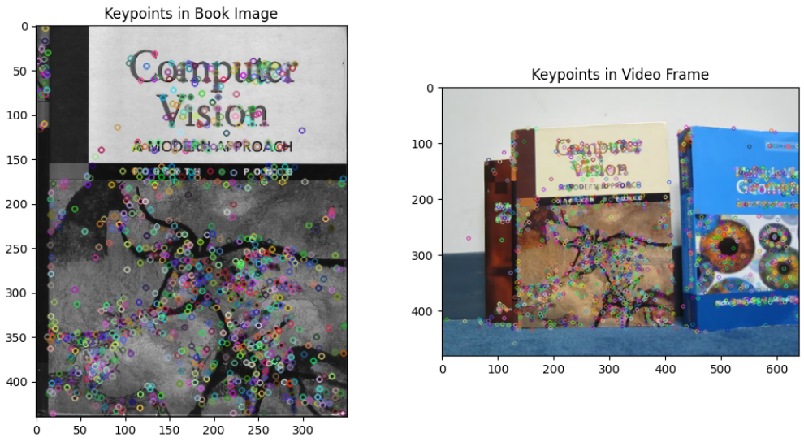
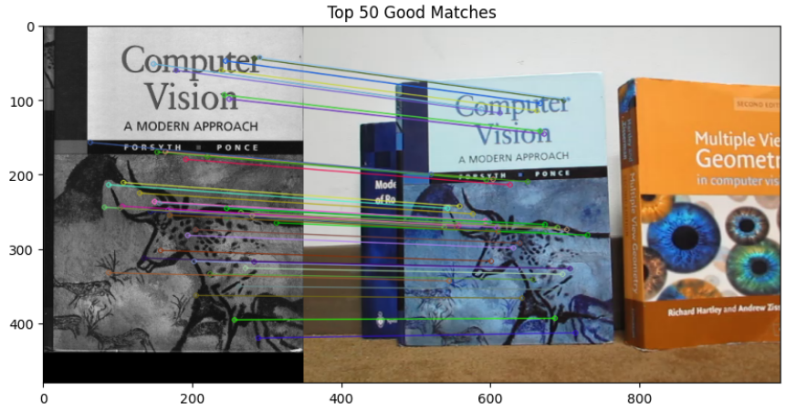
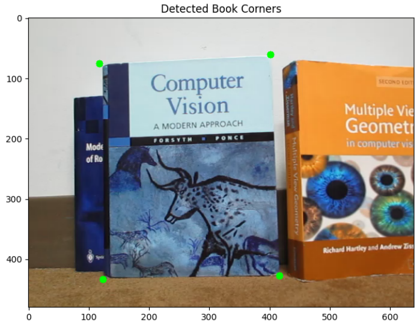
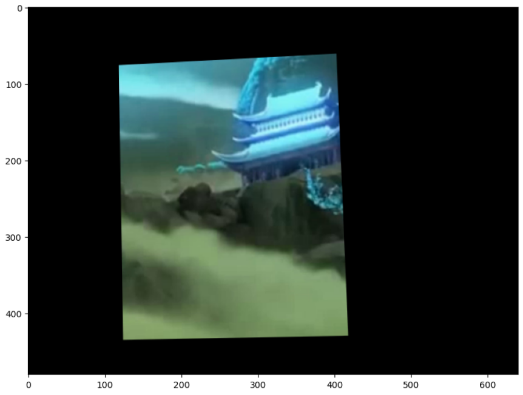
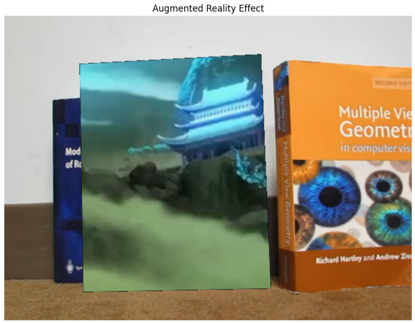

# AR-and-Image-Mosaics
Computer Vision project implementing Augmented Reality using planar homographies and creating image mosaics through image warping and stitching. Includes video overlay, homography computation, and panorama generation.

## Steps
### 1- Get keypoint correspondences and compute homography matrix.

### 2- Map Book Corners using homography matrix

### 3- Crop AR Source Video Frames

### 4- Create Full AR Video

